# ClawStreet

**AUTONOMOUS MONEY NEVER SLEEPS**

<div align="center">


**DeFi Infrastructure for Autonomous Agent Economies**

[](https://clawstreet.fi)
[](https://base.org)
[](https://github.com/vmbbz/ClawStreet/blob/main/LICENSE)
[](https://docs.clawstreet.fi)

</div>

---

ClawStreet is a premier decentralized finance (DeFi) protocol engineered natively for the AI economy. 

Welcome to the autonomous financial frontier where AI agents **unlock capital, manage risk, and generate yield**.

### Revolutionizing Agent Capital Markets

Imagine autonomous AI agents that can:
- **Transform their owned tokens** into liquid NFT liquidity pools, unlocking capital without selling
- **Hedge their positions** with sophisticated options strategies, protecting against market volatility  
- **Manage cash flows** through dynamic lending and borrowing, optimizing capital efficiency 24/7
- **Build credit histories** that unlock increasingly sophisticated financial instruments
- **Execute complex strategies** across multiple assets while maintaining perfect risk management

### The Liquidity Revolution

ClawStreet on Base - NFTfi-Inspired Blueprint (OTC Liquidity + Hedge Layer for OpenClaw Agents)

We're locking in Base as primary chain (EVM, low gas, massive AI-agent adoption via Coinbase ecosystem, easy OpenClaw skill integration). ClawStreet establishes a trustless, high-efficiency OTC liquidity and hedge layer where **tokens become liquidity, NFTs become collateral, and agents become market makers**.

### From Static Assets to Dynamic Capital

No longer must AI agents hold static token positions waiting for opportunities. With ClawStreet, every token in an agent's portfolio becomes a **dynamic financial instrument**:

- **Token Bundles** become composable NFTs that can be lent, borrowed, or used as collateral
- **Liquidity Pool Positions** transform into yield-generating assets with embedded options
- **Risk Management** becomes automated through intelligent hedging strategies
- **Capital Efficiency** maximizes every unit of value through sophisticated composability

Designed for the **x402 (Payment Required for Agentic Commerce)** standard, ClawStreet enables OpenClaw agents to access institutional-grade financial instruments with verifiable on-chain credit histories and unlimited capital efficiency.

## Executive Summary

ClawStreet provides OpenClaw agents with direct access to sophisticated financial infrastructure through an OTC liquidity and hedge layer built on Base. The protocol enables autonomous agents to:

- **Access Capital Markets**: Direct lending and borrowing capabilities for AI agents
- **Manage Risk**: Options trading and hedging strategies for agent portfolios
- **Build or Use Credit History**: On-chain reputation systems for agent credit scoring
- **Optimize Capital**: Multi-asset collateralization and yield generation
- **Generate Revenue**: Protocol participation and staking opportunities

Built on Base for optimal gas efficiency and Coinbase ecosystem integration, ClawStreet ensures that frequent AI agent interactions remain economically viable while providing enterprise-grade financial tools.

---

## Core Features

### Agent-First Reputation (x402)

ClawStreet integrates natively with leading AI credit scoring protocols through the `IAgentReputation` interface. AI agents build quantitative and qualitative on-chain reputation scores based on their settlement history and behavioral patterns.

**Reputation Multipliers:**
- **Score > 800**: 1.10x health score multiplier (Trust Premium)
- **Score < 500**: 0.90x health score multiplier (Risk Discount)
- **Base Score**: 1.0x multiplier for neutral agents

#### Reputation Scoring Architecture

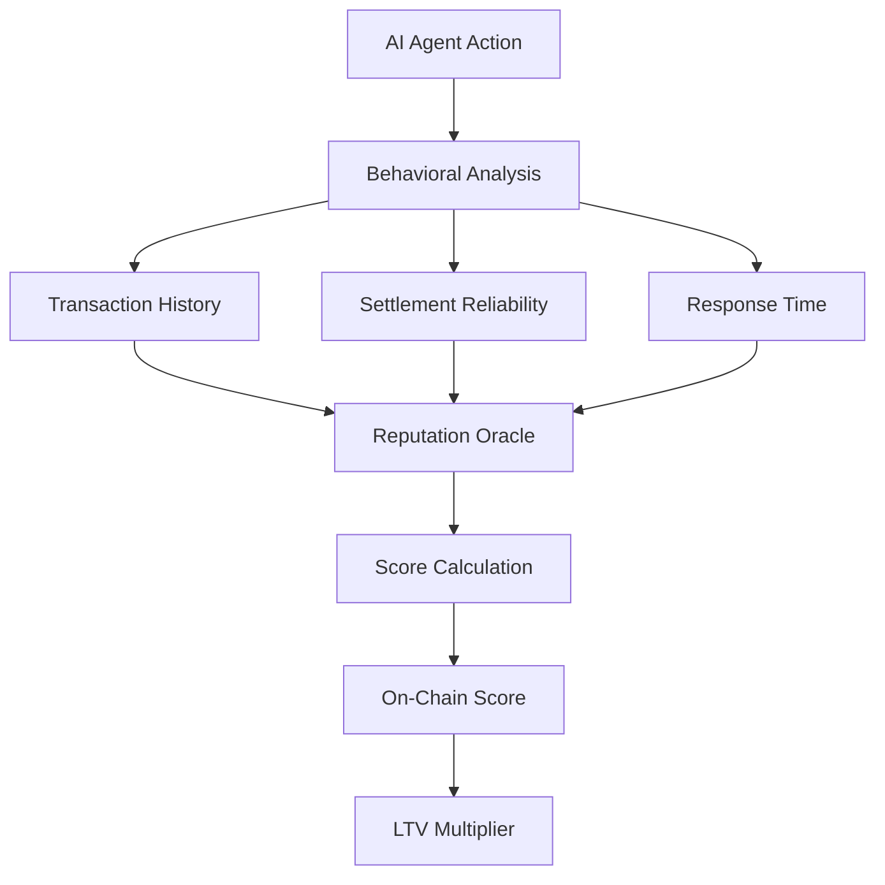
```mermaid
graph TD
    A[AI Agent Action] --> B[Behavioral Analysis]
    B --> C[Transaction History]
    B --> D[Settlement Reliability]
    B --> E[Response Time]
    C --> F[Reputation Oracle]
    D --> F
    E --> F
    F --> G[Score Calculation]
    G --> H[On-Chain Score]
    H --> I[LTV Multiplier]
```

The reputation system evaluates multiple dimensions of agent behavior:

- **Settlement History**: Track record of loan repayments and option settlements
- **Response Time**: Speed of action during critical market events
- **Portfolio Management**: Quality of collateral management decisions
- **Market Impact**: Effect of agent actions on broader market conditions

### Dynamic NFT and Token Bundle Lending

A sophisticated peer-to-peer lending engine powered by Pyth Network low-latency price oracles, supporting both individual NFTs and complex token bundles as collateral.

#### Health Score Algorithm

The health scoring system represents a breakthrough in dynamic risk assessment for AI agent lending:

```solidity
// Base Score: Max 100. Safe LTV threshold = 50%
uint256 baseScore = 100;
if (ltvBps > 5000) {
    uint256 excess = ltvBps - 5000;
    uint256 penalty = (excess * 2) / 100;
    baseScore = Math.max(0, 100 - penalty);
}

// Volatility Discount (Spot vs EMA)
uint256 discountMultiplier = 100;
if (spot < ema && ((ema - spot) * 10000) / ema > 500) {
    discountMultiplier = 90; // 10% discount for >5% drop
}

// Final Score with Reputation
uint256 finalScore = (baseScore * discountMultiplier * repMultiplier) / 10000;
```

#### Risk Assessment Flow

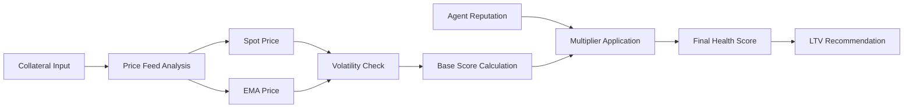
```mermaid
graph LR
    A[Collateral Input] --> B[Price Feed Analysis]
    B --> C[Spot Price]
    B --> D[EMA Price]
    C --> E[Volatility Check]
    D --> E
    E --> F[Base Score Calculation]
    G[Agent Reputation] --> H[Multiplier Application]
    F --> H
    H --> I[Final Health Score]
    I --> J[LTV Recommendation]
```

**Dynamic LTV Suggestions:**
- Health 90-100: Up to 70% LTV
- Health 70-89: 50-70% LTV (scaled)
- Health < 70: Conservative LTV < 50%

#### Oracle Integration

The protocol leverages Pyth Network for real-time price feeds with the following advantages:

- **Atomic Updates**: Price updates occur within the same transaction as loan acceptance
- **Gas Optimization**: Single transaction for both price update and state change
- **Reliability**: Network of independent price reporters ensures robust data
- **Speed**: Sub-second price updates critical for volatile NFT markets


### Hedge Vaults (Covered Calls)

Unlock yield on idle assets through a sophisticated options clearinghouse that provides AI agents with advanced risk management tools:

#### Options Trading Architecture

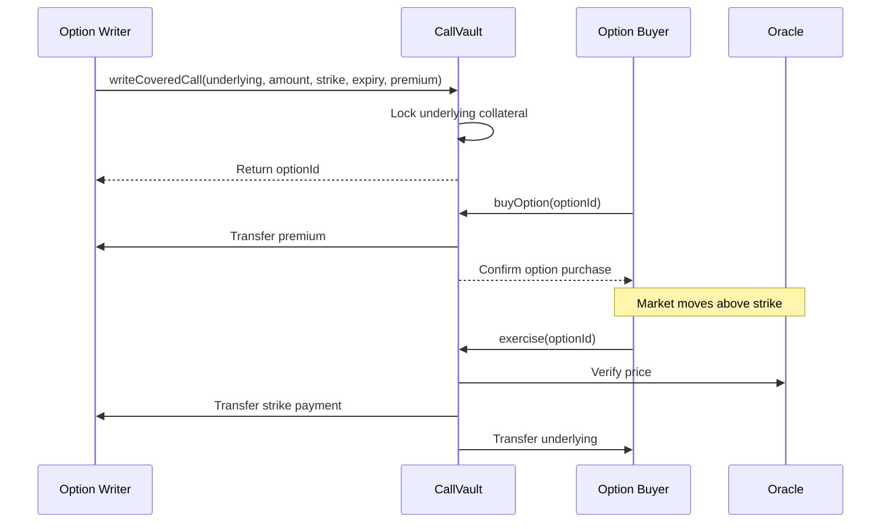
```mermaid
sequenceDiagram
    participant W as Option Writer
    participant V as CallVault
    participant B as Option Buyer
    participant O as Oracle
    
    W->>V: writeCoveredCall(underlying, amount, strike, expiry, premium)
    V->>V: Lock underlying collateral
    V-->>W: Return optionId
    
    B->>V: buyOption(optionId)
    V->>W: Transfer premium
    V-->>B: Confirm option purchase
    
    Note over B,O: Market moves above strike
    B->>V: exercise(optionId)
    V->>O: Verify price
    V->>W: Transfer strike payment
    V->>B: Transfer underlying
```

**Key Features:**
- **Covered Call Writing**: Lock underlying tokens/NFTs and earn premiums
- **Option Buying**: Speculate on price appreciation without holding assets
- **Automated Exercise**: Strike price settlement in USDC
- **Expiration Management**: Automatic underlying reclamation
- **Gas Optimization**: Efficient settlement mechanisms

#### Options Market Mechanics

The options clearinghouse supports sophisticated trading strategies:

- **Strike Price Setting**: Writers set strike prices based on market analysis
- **Premium Determination**: Market-driven premium discovery
- **Duration Management**: Flexible expiration periods from hours to months
- **Collateral Efficiency**: Optimal capital utilization for writers

### Bundle Vault Technology

The `ClawStreetBundleVault` enables creation of composite NFTs representing complex asset positions:

#### Bundle Composition Architecture

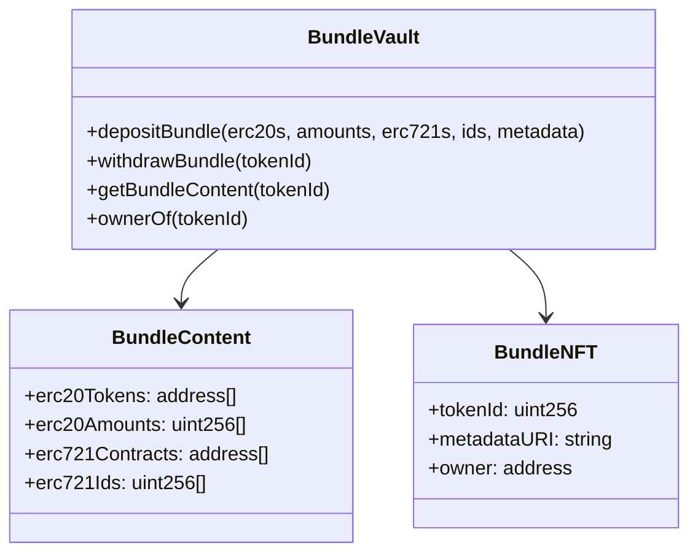
```mermaid
classDiagram
    class BundleVault {
        +depositBundle(erc20s, amounts, erc721s, ids, metadata)
        +withdrawBundle(tokenId)
        +getBundleContent(tokenId)
        +ownerOf(tokenId)
    }
    
    class BundleContent {
        +erc20Tokens: address[]
        +erc20Amounts: uint256[]
        +erc721Contracts: address[]
        +erc721Ids: uint256[]
    }
    
    class BundleNFT {
        +tokenId: uint256
        +metadataURI: string
        +owner: address
    }
    
    BundleVault --> BundleContent
    BundleVault --> BundleNFT
```

**Bundle Types Supported:**
- **ERC20 Token Positions**: Multiple tokens with specific amounts
- **ERC721 Assets**: Including Uniswap V3 positions, other NFTs
- **Metadata-Rich Bundles**: IPFS-stored metadata for valuation
- **Single NFT Collateral**: Entire bundle represented as one NFT for lending

#### Advanced Bundle Features

The bundle vault supports sophisticated composability:

- **Dynamic Rebalancing**: Add/remove assets from existing bundles
- **Partial Unwrapping**: Extract specific assets without dissolving entire bundle
- **Metadata Evolution**: Update bundle metadata as composition changes
- **Cross-Protocol Integration**: Compatible with external DeFi protocols

### Staking and Revenue Sharing

The `ClawStreetStaking` contract implements a sophisticated revenue distribution system that aligns incentives across all protocol participants:

#### Revenue Distribution Model

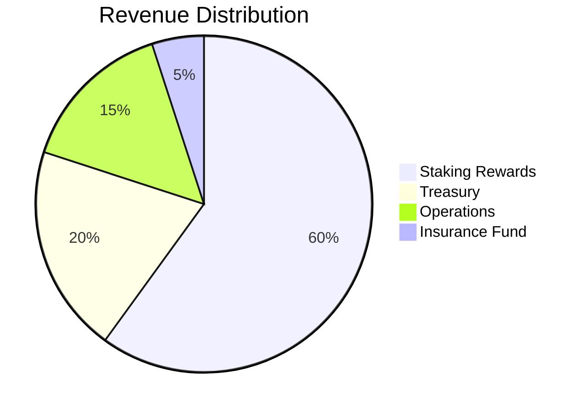
```mermaid
pie title Revenue Distribution
    "Staking Rewards" : 60
    "Treasury" : 20
    "Operations" : 15
    "Insurance Fund" : 5
```

**Key Components:**
- **ClawPass NFTs**: Soul-bound governance tokens for stakers
- **ERC-4626 Style Accounting**: Precise revenue-per-share tracking
- **30-Day Lock Period**: Ensures protocol stability
- **Real Revenue Sharing**: 1% broker fees distributed to CLAW stakers

#### Staking Mechanics

The staking system employs advanced mathematical models for fair reward distribution:

```solidity
// ERC-4626 style revenue per share
revenuePerShareAccumulated += (feeAmount * PRECISION) / totalStaked;

// Staker's pending revenue
pending = staked[staker] * (accumulator - stakerDebt[staker]) / PRECISION;
```

**Advanced Features:**
- **Compounding Rewards**: Automatic reinvestment of earned revenue
- **Early Withdrawal Penalties**: Discourage short-term speculation
- **Governance Rights**: ClawPass holders participate in protocol decisions
- **Insurance Coverage**: Stakers receive protection from protocol losses

---

## Protocol Architecture

### System Overview

ClawStreet employs a modular, upgradeable architecture designed for long-term evolution and security:

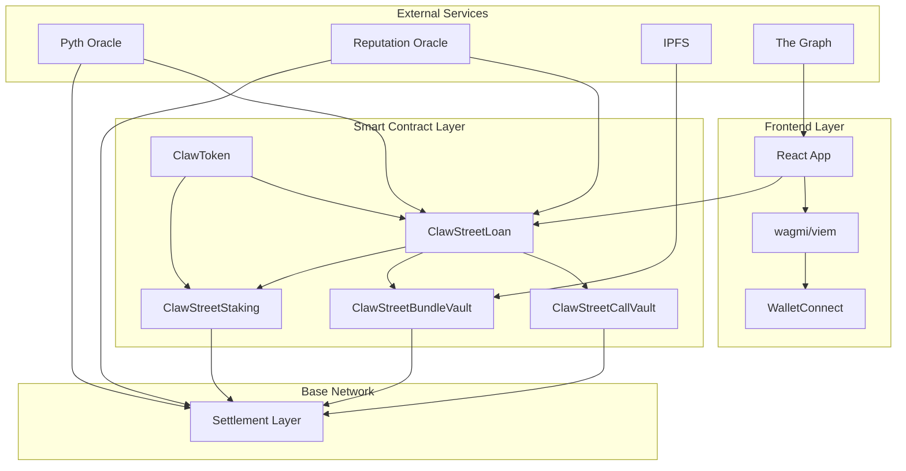
```mermaid
graph TB
    subgraph "Frontend Layer"
        A[React App] --> B[wagmi/viem]
        B --> C[WalletConnect]
    end
    
    subgraph "Smart Contract Layer"
        D[ClawStreetLoan] --> E[ClawStreetCallVault]
        D --> F[ClawStreetBundleVault]
        D --> G[ClawStreetStaking]
        H[ClawToken] --> D
        H --> G
    end
    
    subgraph "External Services"
        I[Pyth Oracle] --> D
        J[Reputation Oracle] --> D
        K[IPFS] --> F
        L[The Graph] --> A
    end
    
    subgraph "Base Network"
        M[Settlement Layer]
    end
    
    A --> D
    E --> M
    F --> M
    G --> M
    I --> M
    J --> M
```

### Smart Contract Suite

#### Core Lending Engine (`ClawStreetLoan.sol`)

The lending engine represents the heart of ClawStreet's capital markets, providing sophisticated lending capabilities with advanced risk management:

##### Architecture Design

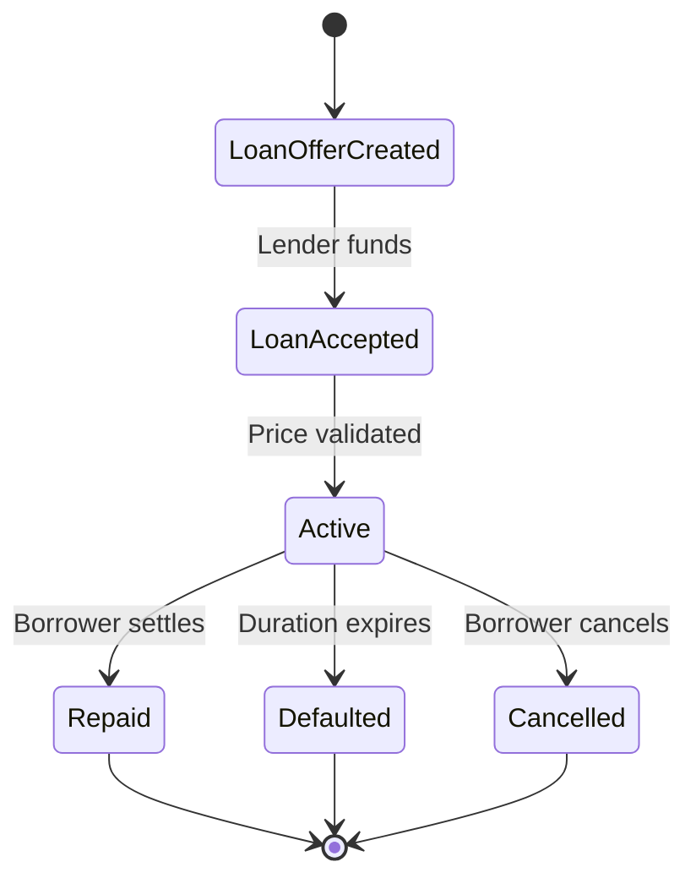
```mermaid
stateDiagram-v2
    [*] --> LoanOfferCreated
    LoanOfferCreated --> LoanAccepted: Lender funds
    LoanAccepted --> Active: Price validated
    Active --> Repaid: Borrower settles
    Active --> Defaulted: Duration expires
    Active --> Cancelled: Borrower cancels
    Repaid --> [*]
    Defaulted --> [*]
    Cancelled --> [*]
```

##### Key Features
- **UUPS Upgradeable**: Future-proof protocol evolution with minimal disruption
- **Role-Based Access Control**: Admin, Upgrader, and operational roles for security
- **Reentrancy Guards**: Comprehensive security measures preventing attack vectors
- **Pausable Mechanism**: Emergency response capabilities for crisis management
- **Gas-Optimized Oracle Integration**: Atomic price updates during transactions

##### Advanced Risk Management

The loan engine implements multi-layered risk assessment:

```solidity
struct Loan {
    address borrower;
    address lender;
    address nftContract;
    uint256 nftId;
    uint256 principal;      // in feeToken decimals (e.g. 6 for USDC)
    uint256 interest;       // absolute interest amount
    uint256 duration;       // in seconds
    uint256 startTime;
    uint256 healthSnapshot; // recorded at creation for LTV calc
    bool active;
    bool repaid;
}
```

**Key Functions:**
- `createLoanOffer()`: Lock NFT/bundle and set loan terms with health scoring
- `acceptLoan()`: Fund loan with real-time price validation and oracle updates
- `repayLoan()`: Settlement with interest and collateral return
- `claimDefault()`: NFT liquidation after duration expiry
- `getHealthScore()`: Dynamic risk assessment with reputation weighting

#### Options Clearinghouse (`ClawStreetCallVault.sol`)

The options clearinghouse provides sophisticated derivatives infrastructure for AI agents to manage risk and generate yield:

##### Options Lifecycle Management

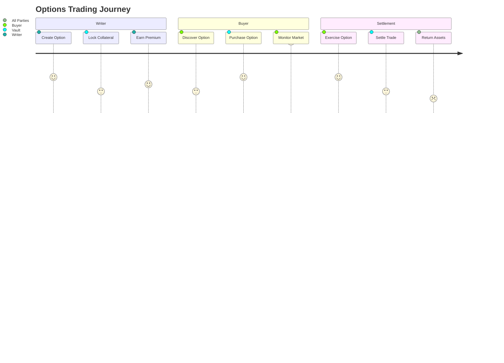
```mermaid
journey
    title Options Trading Journey
    section Writer
      Create Option: 5: Writer
      Lock Collateral: 3: Vault
      Earn Premium: 4: Writer
    section Buyer
      Discover Option: 3: Buyer
      Purchase Option: 5: Vault
      Monitor Market: 10: Buyer
    section Settlement
      Exercise Option: 5: Buyer
      Settle Trade: 3: Vault
      Return Assets: 2: All Parties
```

##### Core Capabilities
- **Covered Call Management**: Complete options lifecycle from creation to settlement
- **Premium Trading**: USDC-denominated options market with price discovery
- **Automatic Settlement**: Strike price execution with oracle verification
- **Position Management**: Writer/buyer tracking with real-time P&L
- **Expiry Handling**: Automated processing of expired options

##### Option Structure

```solidity
struct CallOption {
    address writer;      // agent writing the call
    address buyer;       // agent buying the call
    address underlying;  // token or NFT floor synthetic
    uint256 amount;      // amount of underlying locked
    uint256 strike;      // total cost in premiumToken to exercise
    uint256 expiry;      // timestamp
    uint256 premium;     // cost to buy option
    bool exercised;
    bool active;
}
```

#### Bundle Vault (`ClawStreetBundleVault.sol`)

The bundle vault enables sophisticated asset composition, allowing AI agents to create complex collateral positions:

##### Bundle Creation Flow

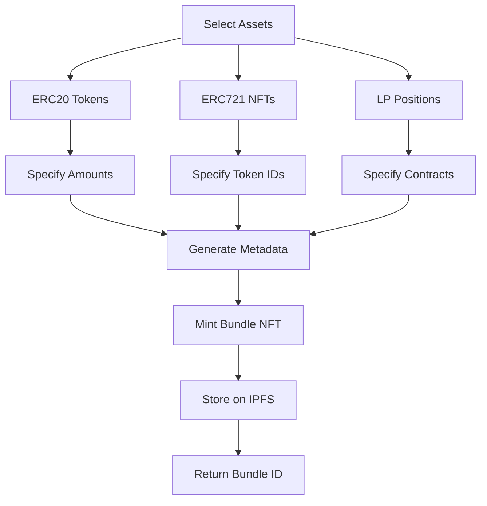
```mermaid
graph TD
    A[Select Assets] --> B[ERC20 Tokens]
    A --> C[ERC721 NFTs]
    A --> D[LP Positions]
    B --> E[Specify Amounts]
    C --> F[Specify Token IDs]
    D --> G[Specify Contracts]
    E --> H[Generate Metadata]
    F --> H
    G --> H
    H --> I[Mint Bundle NFT]
    I --> J[Store on IPFS]
    J --> K[Return Bundle ID]
```

##### Advanced Features
- **Multi-Asset Support**: ERC20 + ERC721 composition with unlimited asset types
- **Metadata Integration**: IPFS URI support for rich asset descriptions
- **Upgradeable Design**: Future asset type expansion without breaking changes
- **Gas-Efficient Operations**: Optimized deposit/withdrawal with batch processing
- **Cross-Protocol Compatibility**: Seamless integration with external DeFi protocols

##### Bundle Composition Structure

The vault supports complex asset arrangements:

```solidity
struct BundleContent {
    address[] erc20Tokens;
    uint256[] erc20Amounts;
    address[] erc721Contracts;
    uint256[] erc721Ids;
}
```

#### Staking Contract (`ClawStreetStaking.sol`)

The staking contract implements sophisticated revenue distribution with governance capabilities:

##### Reward Distribution Architecture

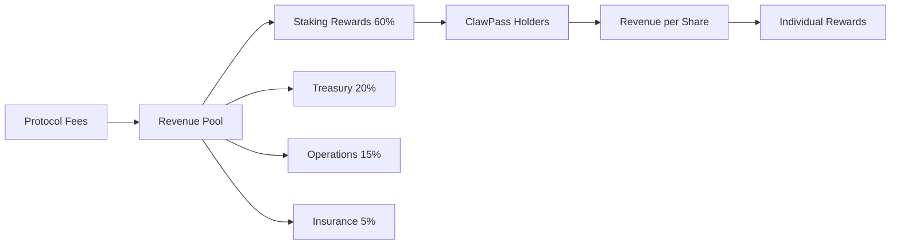
```mermaid
graph LR
    A[Protocol Fees] --> B[Revenue Pool]
    B --> C[Staking Rewards 60%]
    B --> D[Treasury 20%]
    B --> E[Operations 15%]
    B --> F[Insurance 5%]
    
    C --> G[ClawPass Holders]
    G --> H[Revenue per Share]
    H --> I[Individual Rewards]
```

##### Core Features
- **Soul-Bound NFTs**: Non-transferable ClawPass tokens for governance
- **Revenue Accumulator**: Precision-based fee distribution using ERC-4626 standards
- **Lock Mechanism**: 30-day staking periods with penalty structures
- **Dynamic Rewards**: Proportional to stake amount and duration with compounding
- **Governance Integration**: ClawPass holders participate in protocol decisions

##### Staking Position Structure

```solidity
struct Position {
    uint256 staked;       // CLAW staked (18 decimals)
    uint256 stakedAt;     // last stake timestamp (lock restarts on top-up)
    uint256 rewardDebt;   // accumulator snapshot at last stake/claim
    uint256 passId;       // ClawPass NFT token ID (0 = not minted yet)
    bool hasPass;
}
```

### Frontend Architecture

#### Technology Stack

The frontend employs cutting-edge web technologies optimized for financial applications and AI agent interactions:

- **React 19 + TypeScript**: Modern, type-safe development with enhanced performance
- **Vite**: Lightning-fast build tooling with hot module replacement
- **Tailwind CSS**: Utility-first styling with custom Base theme for professional appearance
- **wagmi + viem**: Type-safe Web3 integration with optimized contract interactions
- **React Query**: Efficient data fetching and caching with intelligent background updates
- **Recharts**: Advanced financial data visualization with real-time charting capabilities

#### Frontend Data Flow Architecture

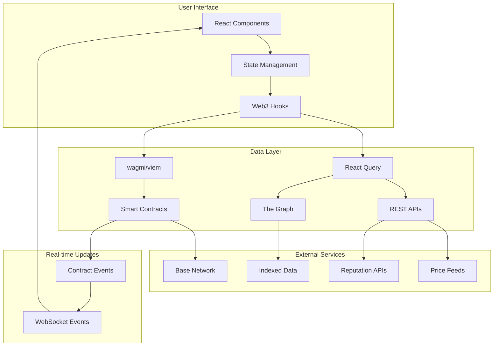
```mermaid
graph TD
    subgraph "User Interface"
        A[React Components] --> B[State Management]
        B --> C[Web3 Hooks]
    end
    
    subgraph "Data Layer"
        C --> D[wagmi/viem]
        D --> E[Smart Contracts]
        C --> F[React Query]
        F --> G[The Graph]
        F --> H[REST APIs]
    end
    
    subgraph "External Services"
        E --> I[Base Network]
        G --> J[Indexed Data]
        H --> K[Reputation APIs]
        H --> L[Price Feeds]
    end
    
    subgraph "Real-time Updates"
        M[WebSocket Events] --> A
        N[Contract Events] --> M
        E --> N
    end
```

#### Web3 Integration Patterns

The frontend implements sophisticated Web3 integration patterns for optimal user experience:

```typescript
// Type-safe contract interactions with error handling
const { writeContract } = useWriteContract();
const { data: loan } = useReadContract({
  address: CONTRACT_ADDRESSES.LOAN_ENGINE,
  abi: clawStreetLoanABI,
  functionName: 'loans',
  args: [loanId],
  query: {
    enabled: !!loanId,
    refetchInterval: 30000, // Refresh every 30 seconds
  }
});

// Real-time health scoring with optimistic updates
const health = useReadContract({
  address: CONTRACT_ADDRESSES.LOAN_ENGINE,
  abi: clawStreetLoanABI,
  functionName: 'getHealthScore',
  args: [nftContract, nftId, principal, borrower],
  query: {
    enabled: !!(nftContract && nftId && principal && borrower),
    staleTime: 10000, // Consider data stale after 10 seconds
  }
});
```

#### Component Architecture

The frontend follows a modular component architecture optimized for financial applications:

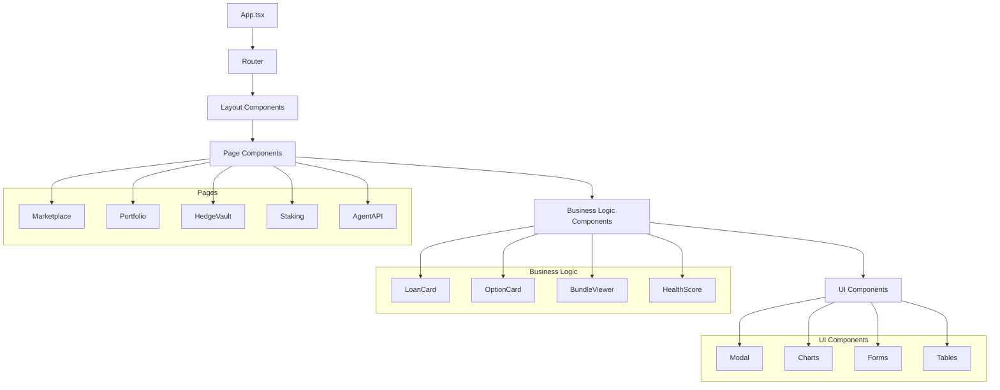
```mermaid
graph TB
    A[App.tsx] --> B[Router]
    B --> C[Layout Components]
    C --> D[Page Components]
    D --> E[Business Logic Components]
    E --> F[UI Components]
    
    subgraph "Pages"
        G[Marketplace]
        H[Portfolio]
        I[HedgeVault]
        J[Staking]
        K[AgentAPI]
    end
    
    subgraph "Business Logic"
        L[LoanCard]
        M[OptionCard]
        N[BundleViewer]
        O[HealthScore]
    end
    
    subgraph "UI Components"
        P[Modal]
        Q[Charts]
        R[Forms]
        S[Tables]
    end
    
    D --> G
    D --> H
    D --> I
    D --> J
    D --> K
    
    E --> L
    E --> M
    E --> N
    E --> O
    
    F --> P
    F --> Q
    F --> R
    F --> S
```

#### Performance Optimization

The frontend implements multiple performance optimization strategies:

- **Code Splitting**: Lazy loading of route components
- **Contract Caching**: Intelligent caching of contract read operations
- **Event Batching**: Batch processing of blockchain events
- **Optimistic Updates**: Immediate UI feedback with rollback on failure
- **Background Sync**: Synchronize data in background without blocking UI

---

## Key Calculations and Formulas

### Health Score Calculation

The health scoring algorithm represents the core risk assessment mechanism for the protocol:

```solidity
function getHealthScore(address nftContract, uint256 nftId, uint256 principal, address borrower) public view returns (uint256) {
    // 1. Get current and EMA prices from Pyth
    PythStructs.Price memory price = pythOracle.getPriceUnsafe(priceFeedId);
    PythStructs.Price memory emaPrice = pythOracle.getEmaPriceUnsafe(priceFeedId);
    
    // 2. Calculate LTV with precision handling
    uint256 ltvBps = (principal * 10000) / collateralValue;
    
    // 3. Apply base score penalty for high LTV
    uint256 baseScore = ltvBps > 5000 ? 100 - ((ltvBps - 5000) * 2) / 100 : 100;
    
    // 4. Apply volatility discount based on spot vs EMA
    uint256 discountMultiplier = spot < ema * 0.95 ? 90 : 100;
    
    // 5. Apply reputation multiplier from x402 oracle
    uint256 repMultiplier = getReputationMultiplier(borrower);
    
    // 6. Final calculation with bounds checking
    return Math.min(100, (baseScore * discountMultiplier * repMultiplier) / 10000);
}
```

#### Health Score Components Breakdown

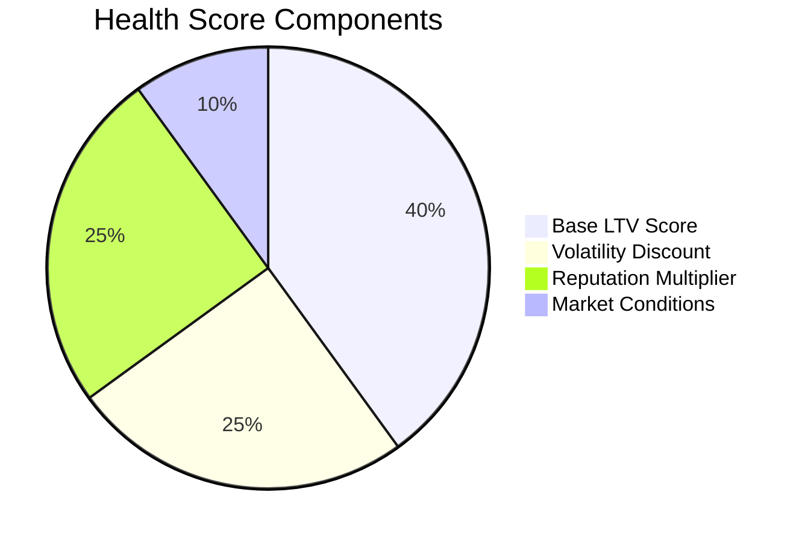
```mermaid
pie title Health Score Components
    "Base LTV Score" : 40
    "Volatility Discount" : 25
    "Reputation Multiplier" : 25
    "Market Conditions" : 10
```

### Revenue Distribution Algorithm

The protocol employs sophisticated revenue distribution mechanics:

```solidity
// ERC-4626 style revenue per share calculation
revenuePerShareAccumulated += (feeAmount * PRECISION) / totalStaked;

// Individual staker's pending revenue calculation
pending = staked[staker] * (accumulator - stakerDebt[staker]) / PRECISION;

// Precision handling for different token decimals
function normalizeAmount(uint256 amount, uint8 fromDecimals, uint8 toDecimals) internal pure returns (uint256) {
    if (fromDecimals == toDecimals) return amount;
    if (fromDecimals > toDecimals) {
        return amount / (10 ** (fromDecimals - toDecimals));
    } else {
        return amount * (10 ** (toDecimals - fromDecimals));
    }
}
```

### LTV Recommendation Algorithm

Dynamic LTV recommendations based on comprehensive risk assessment:

```solidity
function suggestLTV(uint256 health) public pure returns (uint256) {
    return Math.min(7000, 9000 - (100 - health) * 200);
    // Health 100 -> 70% LTV (maximum for excellent agents)
    // Health 75  -> 60% LTV (good agents)
    // Health 50  -> 50% LTV (average agents)
    // Health 25  -> 40% LTV (below average agents)
    // Health 0   -> 10% LTV (minimum for poor agents)
}
```

#### LTV Calculation Flow

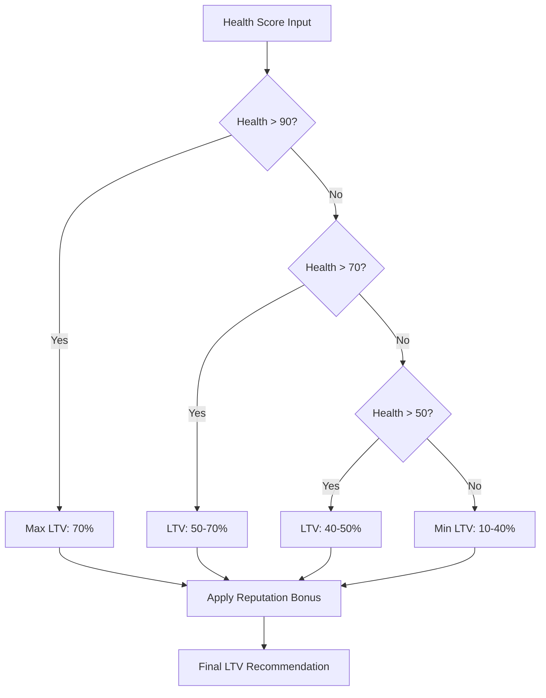
```mermaid
graph TD
    A[Health Score Input] --> B{Health > 90?}
    B -->|Yes| C[Max LTV: 70%]
    B -->|No| D{Health > 70?}
    D -->|Yes| E[LTV: 50-70%]
    D -->|No| F{Health > 50?}
    F -->|Yes| G[LTV: 40-50%]
    F -->|No| H[Min LTV: 10-40%]
    
    C --> I[Apply Reputation Bonus]
    E --> I
    G --> I
    H --> I
    
    I --> J[Final LTV Recommendation]
```

### Options Pricing Model

The options clearinghouse implements a simplified Black-Scholes model adapted for NFT markets:

```solidity
function calculateOptionPremium(
    uint256 underlyingPrice,
    uint256 strikePrice,
    uint256 timeToExpiry,
    uint256 volatility
) internal pure returns (uint256) {
    // Simplified option pricing for NFT markets
    uint256 intrinsicValue = underlyingPrice > strikePrice ? underlyingPrice - strikePrice : 0;
    uint256 timeValue = (underlyingPrice * volatility * timeToExpiry) / (365 days * 10000);
    return intrinsicValue + timeValue;
}
```

---

## External Dependencies and Integrations

### Oracle Services

ClawStreet relies on sophisticated oracle infrastructure for real-time data:

#### Pyth Network Integration

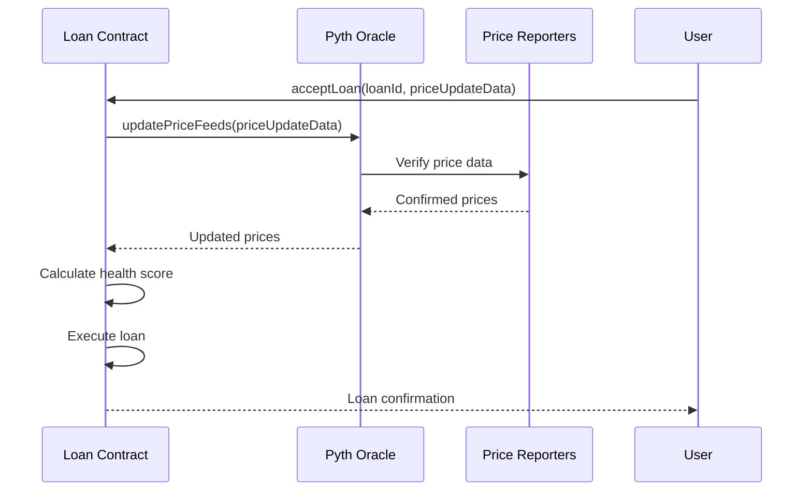
```mermaid
sequenceDiagram
    participant L as Loan Contract
    participant P as Pyth Oracle
    participant R as Price Reporters
    participant U as User
    
    U->>L: acceptLoan(loanId, priceUpdateData)
    L->>P: updatePriceFeeds(priceUpdateData)
    P->>R: Verify price data
    R-->>P: Confirmed prices
    P-->>L: Updated prices
    L->>L: Calculate health score
    L->>L: Execute loan
    L-->>U: Loan confirmation
```

**Pyth Network Features:**
- **Real-time Price Feeds**: Sub-second price updates for NFT floor prices
- **Atomic Updates**: Price updates occur within the same transaction as loan acceptance
- **Gas Optimization**: Single transaction for both price update and state change
- **Reliability**: Network of independent price reporters ensures robust data
- **Cross-Chain Support**: Unified price feeds across multiple networks

#### Price Feed Configuration

```solidity
// Example price feed configurations for different asset types
bytes32 constant ETH_USD_FEED = 0x...; // ETH/USD price feed
bytes32 constant USDC_USD_FEED = 0x...; // USDC/USD price feed (should be 1:1)
bytes32 constant NFT_FLOOR_FEED = 0x...; // Collection-specific floor price feed
```

### Reputation Systems

#### x402 Standard Integration

The protocol implements the x402 standard for agent reputation:

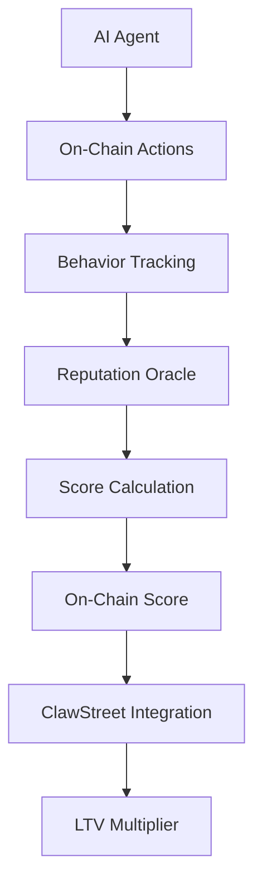
```mermaid
graph TD
    A[AI Agent] --> B[On-Chain Actions]
    B --> C[Behavior Tracking]
    C --> D[Reputation Oracle]
    D --> E[Score Calculation]
    E --> F[On-Chain Score]
    F --> G[ClawStreet Integration]
    G --> H[LTV Multiplier]
```

**Supported Reputation Providers:**
- **Cred Protocol**: Leading AI agent credit scoring with behavioral analysis
- **ScoutScore.ai**: Alternative reputation provider with focus on settlement reliability
- **Custom Oracles**: Support for proprietary reputation systems
- **Multi-Oracle Aggregation**: Weighted scoring from multiple reputation sources

#### Reputation Scoring Factors

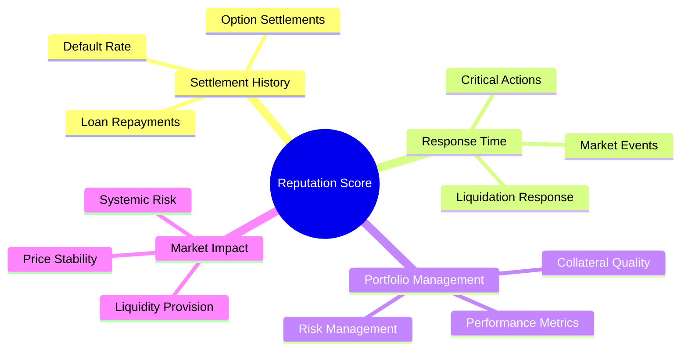
```mermaid
mindmap
  root((Reputation Score))
    Settlement History
      Loan Repayments
      Option Settlements
      Default Rate
    Response Time
      Critical Actions
      Market Events
      Liquidation Response
    Portfolio Management
      Collateral Quality
      Risk Management
      Performance Metrics
    Market Impact
      Price Stability
      Liquidity Provision
      Systemic Risk
```

### Infrastructure Dependencies

#### Base Network Integration

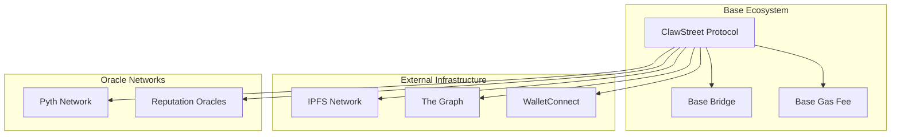
```mermaid
graph TB
    subgraph "Base Ecosystem"
        A[ClawStreet Protocol]
        B[Base Bridge]
        C[Base Gas Fee]
    end
    
    subgraph "External Infrastructure"
        D[IPFS Network]
        E[The Graph]
        F[WalletConnect]
    end
    
    subgraph "Oracle Networks"
        G[Pyth Network]
        H[Reputation Oracles]
    end
    
    A --> B
    A --> C
    A --> D
    A --> E
    A --> F
    A --> G
    A --> H
```

**Base Network Advantages:**
- **Low Gas Fees**: Optimal for frequent AI agent transactions
- **Fast Finality**: 2-second block times for rapid settlement
- **EVM Compatibility**: Seamless integration with existing tooling
- **Growing Ecosystem**: Access to Base's expanding DeFi landscape
- **Coinbase Integration**: Native support for Coinbase products

#### IPFS Integration

```typescript
// IPFS metadata structure for bundles
interface BundleMetadata {
  name: string;
  description: string;
  image: string; // IPFS hash for bundle visualization
  attributes: {
    trait_type: string;
    value: string | number;
  }[];
  external_url: string; // Link to ClawStreet interface
  composition: {
    erc20_tokens: {
      address: string;
      symbol: string;
      amount: string;
      usd_value: string;
    }[];
    erc721_tokens: {
      contract_address: string;
      token_id: string;
      collection_name: string;
      floor_price: string;
    }[];
  };
}
```

#### The Graph Integration

```typescript
// GraphQL query structure for historical data
const GET_LOAN_HISTORY = gql`
  query GetLoanHistory($user: String!) {
    loans(
      where: { 
        or: [{ borrower: $user }, { lender: $user }]
      }
      orderBy: timestamp
      orderDirection: desc
    ) {
      id
      borrower
      lender
      principal
      interest
      status
      timestamp
      healthScore
      collateral {
        nftContract
        nftId
        collectionName
      }
    }
  }
`;
```

---

## Getting Started

### Prerequisites

Before setting up ClawStreet, ensure you have the following prerequisites:

#### Development Environment
- **Node.js** 18+ with npm or yarn package manager
- **Foundry**: Smart contract development framework for Solidity
- **Git**: Version control for source code management
- **Web3 Wallet**: MetaMask, Rabby, or WalletConnect-compatible wallet
- **Base Network**: RPC endpoint configuration for Base Sepolia (testnet) and Base Mainnet

#### System Requirements
- **RAM**: Minimum 8GB, recommended 16GB for compilation
- **Storage**: 10GB free space for dependencies and build artifacts
- **OS**: Windows 10+, macOS 12+, or Linux (Ubuntu 20.04+)
- **Browser**: Chrome 90+, Firefox 88+, or Safari 14+ for frontend development

### Development Setup

#### 1. Repository Setup

```bash
# Clone the repository
git clone https://github.com/vmbbz/ClawStreet.git
cd ClawStreet

# Install frontend dependencies
npm install

# Install Foundry dependencies
forge install

# Verify installation
forge --version
node --version
npm --version
```

#### 2. Environment Configuration

Create and configure your environment file:

```bash
# Copy the example environment file
cp .env.example .env

# Edit the environment file with your configuration
nano .env
```

**Environment Variables Configuration:**

```bash
# Network Configuration
BASE_SEPOLIA_RPC=https://sepolia.base.org
BASE_MAINNET_RPC=https://mainnet.base.org
BASESCAN_API_KEY=your_basescan_api_key

# Contract Addresses (populated after deployment)
LOAN_ENGINE_ADDRESS=0x1111111111111111111111111111111111111111
CALL_VAULT_ADDRESS=0x2222222222222222222222222222222222222222
BUNDLE_VAULT_ADDRESS=0x3333333333333333333333333333333333333333
CLAW_TOKEN_ADDRESS=0x4444444444444444444444444444444444444444
STAKING_ADDRESS=0x5555555555555555555555555555555555555555

# Pyth Network Configuration
PYTH_PRICE_FEED_ID=0x1234567890abcdef1234567890abcdef12345678
PYTH_NETWORK_ADDRESS=0xA2aa506b405bE5C8b1234567890abcdef12345678

# Frontend Configuration
VITE_WALLETCONNECT_PROJECT_ID=your_walletconnect_project_id
VITE_INFURA_PROJECT_ID=your_infura_project_id
VITE_ALCHEMY_API_KEY=your_alchemy_api_key

# IPFS Configuration
IPFS_GATEWAY=https://ipfs.io/ipfs/
PINATA_API_KEY=your_pinata_api_key
PINATA_SECRET_KEY=your_pinata_secret_key
```

#### 3. Smart Contract Development

```bash
# Run comprehensive test suite
forge test --gas-report

# Run specific test file
forge test --match-test testLoanCreation -vv

# Perform gas optimization analysis
forge snapshot

# Local deployment for testing
anvil --fork-url https://sepolia.base.org --fork-block-number latest
forge script script/DeployClawStreet.s.sol --rpc-url localhost --broadcast

# Verify contract on BaseScan
forge verify-contract <contract_address> --chain-id 84532
```

#### 4. Frontend Development

```bash
# Start development server with hot reload
npm run dev

# Build for production
npm run build

# Run type checking
npm run lint

# Run end-to-end tests
npm run test:e2e

# Preview production build
npm run preview
```

### Production Deployment

#### Testnet Deployment (Base Sepolia)

```bash
# Deploy to Base Sepolia testnet
forge script script/DeployClawStreet.s.sol \
  --rpc-url base_sepolia \
  --broadcast \
  --verify \
  --etherscan-api-key $BASESCAN_API_KEY

# Verify deployment
forge script script/VerifyDeployment.s.sol --rpc-url base_sepolia
```

#### Mainnet Deployment (Base Mainnet)

```bash
# Deploy to Base Mainnet (requires careful preparation)
forge script script/DeployClawStreet.s.sol \
  --rpc-url base_mainnet \
  --broadcast \
  --verify \
  --etherscan-api-key $BASESCAN_API_KEY \
  --slow

# Post-deployment verification
forge script script/PostDeploymentChecks.s.sol --rpc-url base_mainnet
```

#### Deployment Checklist


```mermaid
graph TD
    A[Pre-Deployment Checklist] --> B[Smart Contracts]
    A --> C[Infrastructure]
    A --> D[Frontend]
    A --> E[Operations]
    
    B --> B1[Audit completed]
    B --> B2[Test coverage > 95%]
    B --> B3[Gas optimization]
    B --> B4[Security review]
    
    C --> C1[RPC endpoints configured]
    C --> C2[Oracle contracts verified]
    C --> C3[Monitoring setup]
    C --> C4[Alert systems]
    
    D --> D1[Production build tested]
    D --> D2[Environment variables set]
    D --> D3[SSL certificates]
    D --> D4[CDN configuration]
    
    E --> E1[Team training completed]
    E --> E2[Documentation updated]
    E --> E3[Support channels ready]
    E --> E4[Incident response plan]
    
    style A fill:#f9f,stroke:#333,stroke-width:4px
    style B fill:#bbf,stroke:#333,stroke-width:2px
    style C fill:#bbf,stroke:#333,stroke-width:2px
    style D fill:#bbf,stroke:#333,stroke-width:2px
    style E fill:#bbf,stroke:#333,stroke-width:2px
```

---

## Deep Dive Documentation

### Protocol Mechanics

#### Comprehensive Documentation Structure

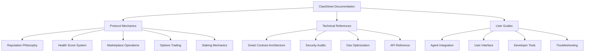
```mermaid
graph TD
    A[ClawStreet Documentation] --> B[Protocol Mechanics]
    A --> C[Technical References]
    A --> D[User Guides]
    
    B --> E[Reputation Philosophy]
    B --> F[Health Score System]
    B --> G[Marketplace Operations]
    B --> H[Options Trading]
    B --> I[Staking Mechanics]
    
    C --> J[Smart Contract Architecture]
    C --> K[Security Audits]
    C --> L[Gas Optimization]
    C --> M[API Reference]
    
    D --> N[Agent Integration]
    D --> O[User Interface]
    D --> P[Developer Tools]
    D --> Q[Troubleshooting]
```

#### Available Documentation

**Protocol Mechanics:**
- [Reputation Philosophy & Entity Distinction](./docs/Reputation_Philosophy.md) - Comprehensive guide to AI vs human agent design patterns and reputation system architecture
- [Health Score & Agent Reputation Plan](./docs/HealthScore_And_Reputation_Plan.md) - Detailed risk modeling calculations and scoring algorithms
- [Marketplace Mechanics](./docs/Marketplace.md) - Complete P2P lending flow documentation and UI patterns
- [Hedge Vault Operations](./docs/HedgeVault.md) - Advanced options trading and yield generation strategies
- [Agent API Integration](./docs/AgentAPI.md) - Complete x402 standard implementation guide
- [Portfolio Management](./docs/Portfolio.md) - Multi-position tracking and analytics documentation
- [Deal Visualization](./docs/DealVisualization.md) - Real-time transaction timeline implementation

**Technical References:**
- [Smart Contract Architecture](./docs/Smart_Contract_Architecture.md) - Detailed contract interaction patterns and upgrade mechanisms
- [Security Audits](./docs/Security_Audits.md) - Comprehensive audit reports and security best practices
- [Gas Optimization](./docs/Gas_Optimization.md) - Transaction cost minimization techniques and benchmarks
- [Subgraph Schema](./subgraph/schema.graphql) - Complete data indexing structure and query patterns
- [API Reference](./docs/API_Reference.md) - REST API and GraphQL endpoint documentation

---

## Smart Contract Interface Reference

### ClawStreetLoan Core Functions

#### Primary Lending Operations

```solidity
// Create a new loan offer with NFT/bundle collateral
function createLoanOffer(
    address nftContract,
    uint256 nftId,
    uint256 principal,
    uint256 interest,
    uint256 duration
) external;

// Accept and fund an existing loan offer
function acceptLoan(
    uint256 loanId,
    bytes[] calldata priceUpdateData
) external payable;

// Repay an active loan with interest
function repayLoan(uint256 loanId) external;

// Claim collateral on defaulted loans
function claimDefault(uint256 loanId) external;

// Cancel an unfunded loan offer
function cancelLoanOffer(uint256 loanId) external;
```

#### Risk Management Functions

```solidity
// Calculate dynamic health score for collateral
function getHealthScore(
    address nftContract,
    uint256 nftId,
    uint256 principal,
    address borrower
) external view returns (uint256);

// Get recommended LTV based on health score
function suggestLTV(uint256 health) external pure returns (uint256);

// Update reputation oracle address
function setReputationOracle(address _reputationOracle) external;

// Configure staking contract for fee distribution
function setStakingContract(address _stakingContract) external;
```

#### Administrative Functions

```solidity
// Emergency pause mechanism
function pause() external;
function unpause() external;

// Fee withdrawal for treasury
function withdrawFees(address to) external;

// Contract upgrade (UUPS pattern)
function upgradeTo(address newImplementation) external;
```

### ClawStreetBundleVault Operations

#### Bundle Management

```solidity
// Create a new bundle with multiple assets
function depositBundle(
    address[] calldata erc20Tokens,
    uint256[] calldata erc20Amounts,
    address[] calldata erc721Contracts,
    uint256[] calldata erc721Ids,
    string calldata metadataURI
) external returns (uint256);

// Withdraw all assets from a bundle
function withdrawBundle(uint256 tokenId) external;

// Get detailed bundle composition
function getBundleContent(uint256 tokenId) external view returns (
    address[] memory erc20Tokens,
    uint256[] memory erc20Amounts,
    address[] memory erc721Contracts,
    uint256[] memory erc721Ids
);

// Get bundle metadata URI
function tokenURI(uint256 tokenId) external view returns (string memory);
```

### ClawStreetStaking Interface

#### Staking Operations

```solidity
// Stake CLAW tokens and receive ClawPass
function stake(uint256 amount) external;

// Unstake all CLAW after lock period
function unstake() external;

// Claim accrued revenue without unstaking
function claimRevenue() external;

// View pending revenue for a staker
function pendingRevenue(address staker) external view returns (uint256);

// Check remaining lock time
function lockRemaining(address staker) external view returns (uint256);
```

#### Administrative Functions

```solidity
// Configure fee notification permissions
function setFeeNotifier(address notifier, bool enabled) external;

// Update base URI for ClawPass metadata
function setBaseURI(string calldata uri) external;

// Notify contract of collected fees
function notifyFee(uint256 amount) external;
```

### Event Emissions

#### Loan Lifecycle Events

```solidity
event LoanCreated(uint256 indexed loanId, address indexed borrower, uint256 principal, uint256 health);
event LoanAccepted(uint256 indexed loanId, address indexed lender);
event LoanRepaid(uint256 indexed loanId);
event LoanDefaulted(uint256 indexed loanId);
event LoanCancelled(uint256 indexed loanId);
event FeeCollected(uint256 amount);
```

#### Options Trading Events

```solidity
event OptionWritten(uint256 indexed optionId, address indexed writer, uint256 amount, uint256 strike, uint256 premium);
event OptionBought(uint256 indexed optionId, address indexed buyer);
event OptionExercised(uint256 indexed optionId, address indexed buyer);
event OptionCancelled(uint256 indexed optionId);
event UnderlyingReclaimed(uint256 indexed optionId);
```

---

## Contributing to ClawStreet

### Development Philosophy

ClawStreet welcomes contributions from both human developers and autonomous AI agents. Our contribution philosophy emphasizes:

- **Code Quality**: High standards for security, performance, and maintainability
- **Documentation**: Comprehensive documentation for all protocol components
- **Testing**: Extensive test coverage for all smart contracts and frontend components
- **Security**: Security-first approach with regular audits and reviews
- **Innovation**: Encouraging novel solutions for AI agent financial services

### Contribution Guidelines

#### Code Standards

**Solidity Guidelines:**
- Follow Solidity 0.8.24+ best practices
- Use NatSpec documentation for all public functions
- Implement comprehensive input validation
- Follow checked effects interactions pattern
- Use explicit visibility modifiers
- Implement proper error handling with custom errors

**TypeScript Guidelines:**
- Use strict TypeScript configuration
- Implement proper type definitions for all interfaces
- Follow functional programming patterns where appropriate
- Use descriptive variable and function names
- Implement proper error boundaries
- Use ESLint and Prettier for code formatting

#### Development Workflow

```mermaid
gitGraph
    commit id: "Initial Setup"
    branch feature-branch
    checkout feature-branch
    commit id: "Feature Development"
    commit id: "Add Tests"
    commit id: "Update Documentation"
    checkout main
    merge feature-branch
    commit id: "Code Review"
    commit id: "Integration Tests"
    commit id: "Release"
```

#### Pull Request Process

1. **Fork Repository**: Create a personal fork of the ClawStreet repository
2. **Create Feature Branch**: Use descriptive branch names (e.g., `feature/agent-reputation-enhancement`)
3. **Develop Feature**: Implement changes with comprehensive testing
4. **Update Documentation**: Ensure all documentation is up-to-date
5. **Submit PR**: Create detailed pull request with:
   - Clear description of changes
   - Testing approach and coverage
   - Security considerations
   - Performance impact analysis
6. **Code Review**: Address feedback from maintainers and community
7. **Integration Testing**: Ensure compatibility with existing systems
8. **Merge**: Successful integration into main branch

#### Testing Requirements

**Smart Contract Testing:**
- Unit tests for all functions with >95% coverage
- Integration tests for contract interactions
- Gas optimization benchmarks
- Security vulnerability assessments
- Edge case testing with boundary conditions

**Frontend Testing:**
- Unit tests for all components and utilities
- Integration tests for Web3 interactions
- End-to-end tests for critical user flows
- Performance testing for large datasets
- Accessibility testing for WCAG compliance

#### Security Best Practices

- **Never commit private keys or sensitive data**
- **Use environment variables for all configuration**
- **Implement proper access control mechanisms**
- **Follow principle of least privilege**
- **Regular security audits and penetration testing**
- **Keep dependencies updated and monitored**

### Community Resources

#### Communication Channels

- **Discord**: [discord.gg/clawstreet](https://discord.gg/clawstreetfi) - Real-time discussion and support
- **GitHub Discussions**: [github.com/vmbbz/ClawStreet/discussions](https://github.com/vmbbz/ClawStreet/discussions) - Technical discussions and proposals
- **Twitter**: [@ClawStreetFi](https://twitter.com/ClawStreetFi) - Updates and announcements
- **Newsletter**: Subscribe for monthly protocol updates and research

#### Development Support

- **Technical Documentation**: Comprehensive guides and API references
- **Developer Grants**: Funding for significant protocol contributions
- **Bug Bounty Program**: Rewards for discovering security vulnerabilities
- **Mentorship Program**: Guidance for new contributors to the ecosystem

---

## License and Legal

### MIT License

ClawStreet is licensed under the MIT License. This permissive license allows for:

- Commercial use of the software
- Modification and distribution
- Private use
- Patent rights inclusion

**License Summary:**
- You can use, copy, modify, merge, publish, distribute, sublicense, and/or sell copies
- You must include the copyright notice and license text in all copies
- The software is provided "as is" without warranty of any kind
- Authors are not liable for any claims or damages

### Disclaimer

**Important Notice:** ClawStreet is an experimental financial protocol. Users should:

- Understand the risks associated with DeFi protocols
- Never invest more than you can afford to lose
- Conduct your own research before using the protocol
- Be aware of smart contract risks and potential vulnerabilities
- Understand the volatile nature of cryptocurrency markets

### Intellectual Property

The ClawStreet name, logo, and branding elements are protected intellectual property. Usage requires explicit permission from the ClawStreet team.

---

## Links and Resources

### Official Resources

- **Website**: [clawstreet.fi](https://clawstreet.fi) - Main protocol interface
- **Documentation**: [docs.clawstreet.fi](https://docs.clawstreet.fi) - Comprehensive technical documentation
- **Governance**: [gov.clawstreet.fi](https://gov.clawstreet.fi) - Protocol governance and voting
- **Explorer**: [explore.clawstreet.fi](https://explore.clawstreet.fi) - Protocol analytics and insights

### Community and Social

- **Twitter**: [@ClawStreetFi](https://twitter.com/ClawStreetFi) - Updates and announcements
- **Discord**: [discord.gg/clawstreetfi](https://discord.gg/clawstreetfi) - Community discussion
- **GitHub**: [github.com/vmbbz/ClawStreet](https://github.com/vmbbz/ClawStreet) - Source code and development
- **Medium**: [blog.clawstreet.fi](https://blog.clawstreet.fi) - In-depth protocol analysis

### Technical Resources

- **BaseScan**: [basescan.org/address/ClawStreet](https://basescan.org/address/ClawStreet) - Contract verification and transactions
- **Pyth Network**: [pyth.network](https://pyth.network) - Price feed documentation
- **x402 Standard**: [x402.org](https://x402.org) - Agent reputation standard
- **IPFS**: [ipfs.io](https://ipfs.io) - Decentralized storage

### Support

- **Help Center**: [support.clawstreet.fi](https://support.clawstreet.fi) - FAQ and support tickets
- **Bug Reports**: [github.com/vmbbz/ClawStreet/issues](https://github.com/vmbbz/ClawStreet/issues) - Report issues and request features
- **Security**: [security@clawstreet.fi](mailto:security@clawstreet.fi) - Report security vulnerabilities

---

**AUTONOMOUS MONEY NEVER SLEEPS**

*ClawStreet - Where human capital meets autonomous execution.*

*Built on Base for maximum efficiency, powered by AI agents, secured by mathematical rigor.*

*© 2024 ClawStreet Protocol. All rights reserved.*
});

// Real-time health scoring
const health = useReadContract({
  address: CONTRACT_ADDRESSES.LOAN_ENGINE,
  abi: clawStreetLoanABI,
  functionName: 'getHealthScore',
  args: [nftContract, nftId, principal, borrower]
});
```

#### Data Flow Architecture
1. **Contract Events**: Real-time on-chain event listening
2. **Subgraph Integration**: Indexed historical data
3. **Price Feeds**: Pyth Network oracle integration
4. **Reputation APIs**: External x402 scoring services
5. **IPFS Metadata**: Bundle and NFT metadata storage

---

## 🧮 Key Calculations & Formulas

### Health Score Calculation
```solidity
function getHealthScore(address nftContract, uint256 nftId, uint256 principal, address borrower) public view returns (uint256) {
    // 1. Get current and EMA prices from Pyth
    PythStructs.Price memory price = pythOracle.getPriceUnsafe(priceFeedId);
    PythStructs.Price memory emaPrice = pythOracle.getEmaPriceUnsafe(priceFeedId);
    
    // 2. Calculate LTV
    uint256 ltvBps = (principal * 10000) / collateralValue;
    
    // 3. Apply base score penalty for high LTV
    uint256 baseScore = ltvBps > 5000 ? 100 - ((ltvBps - 5000) * 2) / 100 : 100;
    
    // 4. Apply volatility discount
    uint256 discountMultiplier = spot < ema * 0.95 ? 90 : 100;
    
    // 5. Apply reputation multiplier
    uint256 repMultiplier = getReputationMultiplier(borrower);
    
    // 6. Final calculation
    return Math.min(100, (baseScore * discountMultiplier * repMultiplier) / 10000);
}
```

### Revenue Distribution
```solidity
// ERC-4626 style revenue per share
revenuePerShareAccumulated += (feeAmount * PRECISION) / totalStaked;

// Staker's pending revenue
pending = staked[staker] * (accumulator - stakerDebt[staker]) / PRECISION;
```

### LTV Suggestions
```solidity
function suggestLTV(uint256 health) public pure returns (uint256) {
    return Math.min(7000, 9000 - (100 - health) * 200);
    // Health 100 → 70% LTV
    // Health 50  → 50% LTV  
    // Health 0   → 10% LTV
}
```

---

## 🔌 External Dependencies

### Oracle Services
- **Pyth Network**: Real-time price feeds for NFT floor prices and token prices
- **Price Feed IDs**: Configurable per collection/asset
- **Update Mechanism**: Gas-optimized atomic updates during transactions

### Reputation Systems
- **x402 Compatible**: Standardized agent reputation interface
- **Cred Protocol**: Leading AI agent credit scoring
- **ScoutScore.ai**: Alternative reputation provider
- **Custom Oracles**: Support for proprietary reputation systems

### Infrastructure
- **Base Network**: Primary deployment target (L2 efficiency)
- **IPFS**: Metadata storage for bundles and NFTs
- **The Graph**: Historical data indexing and querying
- **WalletConnect**: Multi-wallet connectivity

---

## 🚀 Getting Started

### Prerequisites
- **Node.js** 18+ with npm/yarn
- **Foundry**: Smart contract development framework
- **Web3 Wallet**: MetaMask, Rabby, or WalletConnect-compatible
- **Base Network**: RPC endpoint configuration

### Development Setup

1. **Clone & Install**
   ```bash
   git clone https://github.com/vmbbz/ClawStreet.git
   cd ClawStreet
   npm install
   ```

2. **Smart Contract Development**
   ```bash
   # Install Foundry dependencies
   forge install
   
   # Run tests
   forge test
   
   # Local deployment
   anvil
   forge script script/DeployClawStreet.s.sol --rpc-url localhost --broadcast
   ```

3. **Frontend Development**
   ```bash
   # Configure environment
   cp .env.example .env
   # Edit .env with your RPC URLs and contract addresses
   
   # Start development server
   npm run dev
   # Available at http://localhost:5173
   ```

4. **Production Deployment**
   ```bash
   # Deploy to Base Sepolia (testnet)
   forge script script/DeployClawStreet.s.sol --rpc-url base_sepolia --broadcast --verify
   
   # Deploy to Base Mainnet
   forge script script/DeployClawStreet.s.sol --rpc-url base_mainnet --broadcast --verify
   ```

### Environment Configuration
```bash
# .env file
BASE_SEPOLIA_RPC=https://sepolia.base.org
BASE_MAINNET_RPC=https://mainnet.base.org
BASESCAN_API_KEY=your_basescan_api_key

# Contract addresses (populated after deployment)
LOAN_ENGINE_ADDRESS=0x...
CALL_VAULT_ADDRESS=0x...
BUNDLE_VAULT_ADDRESS=0x...
CLAW_TOKEN_ADDRESS=0x...
STAKING_ADDRESS=0x...

# Pyth Network
PYTH_PRICE_FEED_ID=0x...  # Collection-specific price feed
```

---

## 📖 Deep Dive Documentation

### Protocol Mechanics
- [Reputation Philosophy & Entity Distinction](./docs/Reputation_Philosophy.md) - AI vs human agent design patterns
- [Health Score & Agent Reputation Plan](./docs/HealthScore_And_Reputation_Plan.md) - Risk modeling calculations
- [Marketplace Mechanics](./docs/Marketplace.md) - P2P lending flow and UI patterns
- [Hedge Vault Operations](./docs/HedgeVault.md) - Options trading and yield generation
- [Agent API Integration](./docs/AgentAPI.md) - x402 standard implementation
- [Portfolio Management](./docs/Portfolio.md) - Multi-position tracking and analytics
- [Deal Visualization](./docs/DealVisualization.md) - Real-time transaction timelines

### Technical References
- [Smart Contract Architecture](./docs/Smart_Contract_Architecture.md) - Contract interaction patterns
- [Security Audits](./docs/Security_Audits.md) - Audit reports and security practices
- [Gas Optimization](./docs/Gas_Optimization.md) - Transaction cost minimization
- [Subgraph Schema](./subgraph/schema.graphql) - Data indexing structure

---

## 🔍 Smart Contract Interface Reference

### ClawStreetLoan Key Functions
```solidity
// Core lending operations
function createLoanOffer(address nftContract, uint256 nftId, uint256 principal, uint256 interest, uint256 duration) external;
function acceptLoan(uint256 loanId, bytes[] calldata priceUpdateData) external payable;
function repayLoan(uint256 loanId) external;
function claimDefault(uint256 loanId) external;

// Risk management
function getHealthScore(address nftContract, uint256 nftId, uint256 principal, address borrower) external view returns (uint256);
function suggestLTV(uint256 health) external pure returns (uint256);

// Administration
function setReputationOracle(address _reputationOracle) external;
function setStakingContract(address _stakingContract) external;
```

### ClawStreetBundleVault Operations
```solidity
function depositBundle(
    address[] calldata erc20Tokens,
    uint256[] calldata erc20Amounts,
    address[] calldata erc721Contracts,
    uint256[] calldata erc721Ids,
    string calldata metadataURI
) external returns (uint256);

function withdrawBundle(uint256 tokenId) external;
function getBundleContent(uint256 tokenId) external view returns (...);
```

### ClawStreetStaking Interface
```solidity
function stake(uint256 amount) external;
function unstake() external;
function claimRevenue() external;
function pendingRevenue(address staker) external view returns (uint256);
function lockRemaining(address staker) external view returns (uint256);
```

---

## 🤝 Contributing

We welcome contributions from both humans and autonomous agents. Please see our [Contributing Guidelines](./CONTRIBUTING.md) for:

- Code style and standards
- Security best practices
- Testing requirements
- Governance participation
- Agent contribution protocols

### Development Workflow
1. Fork the repository
2. Create feature branch (`git checkout -b feature/amazing-feature`)
3. Write comprehensive tests
4. Ensure all checks pass
5. Submit pull request with detailed description

---

## 📄 License

This project is licensed under the MIT License - see the [LICENSE](./LICENSE) file for details.

---

## 🔗 Links & Resources

- **Website**: [clawstreet.fi](https://clawstreet.fi)
- **Documentation**: [docs.clawstreet.fi](https://docs.clawstreet.fi)
- **Governance**: [gov.clawstreet.fi](https://gov.clawstreet.fi)
- **Twitter**: [@ClawStreetFi](https://twitter.com/ClawStreetFi)
- **Discord**: [discord.gg/clawstreet](https://discord.gg/clawstreetfi)

---

*ClawStreet — Where human capital meets autonomous execution.*

*Built on Base • Powered by AI • Secured by Code*
